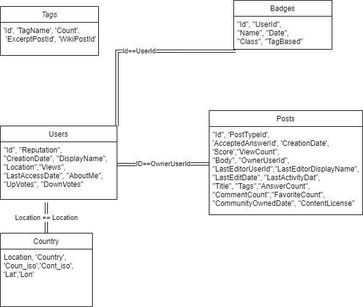

# Big data project
## Introduction
This project aims to analyze and do some machine learning on a sample stack overflow questions data. It contains several parts.
- One part (\Data folder) concerns the data getting and loading. (Be sure to readme on this folder for more information)
- A second part concerns the data exploration of this sample using pyspark
- A third part concerns clustering of the questions using LDA using Spark Ml
- A final part concerns multi label classification of the tags of a question using Keras and SparkMl

## Installation 
This project has mounted with a Docker image to be able to run easaly each notebooks which are based on differents frameworks. 

### Getting the Docker image
To use the image you can either mount it frome the Docker file 
```{shell}
path/to/repo> docker build -t simaposor/project .
```

Or download it  from the cloud 

### To run the image 
To run the image and the notebooks inside the container run this command
```{shell}
> docker run -d -p 8888:8888 -p 4040:4040 -p 4041:4041 -v path/to/repo:/home/loic -e JUPYTER_TOKEN=your_custom_password -e XDG_RUNTIME_DIR="" simaposor/project
```
The first port argument is the port argument of the jupyter notebook, the second and the third are the one for spark dashboards. Be sure that those port are available on your machine.
The volume argument connects the repo directory to the work directory of the notebooks (make sure to change it to the repo folder). The jupyter token is the password that would be asked to enter jupyter. 

### Open jupyter notebook 
1. Open your internet navigator
2. Search for the address : http://localhost:8888/
3. Enter the password you put as JUPYTER_TOKEN env variable (your_custom_password in the exemple)

You can now open and get through all the notebooks.

## Project summary
### Getting the data 
The /Data folder contains one Notebook named `DataLoader.ipynb`. Its goal is to sample the stack overflow data which is too heavy to be treated. **This notebook is not meant to be runned**. It can be runned if you follow the instructions in it but it will be really long. It is just here to show how we sampled the data. **All the other notebooks are based on the produced sampled data which will be automaticaly dowloaded by custom functions when needed**. This data sample is can be also be mannually downloaded [here](https://drive.google.com/drive/folders/1ddsBX4I4hZ8pordSKf5cHRaVBnNVOcKk) if needed.

### Some First Insights
The /Notebooks contains a Notebook named `Some first insights.ipynb`. Its goal is to present the sampled stackoverflow data we have, do plots about it etc. It is the fun/playground part of the project.